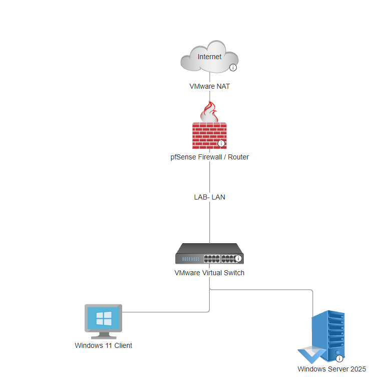

# pfSense-homelab

## Overview

This project is a virtualized networking and security homelab built using
VMware Workstation and pfSense.

The purpose of the lab is to gain hands-on experience with routing,
firewall configuration, VLAN segmentation, Windows Active Directory,
Linux administration, and security monitoring.

## Lab Environment

- VMware Workstation Pro
- pfSense CE
- Windows Server 2025
- Windows 11
- Ubuntu Server
- Kali Linux
- Splunk

## Current Network Topology

## Network Addressing

## Network Addressing

- **pfSense LAN:** 192.168.10.1
  - Default gateway for the lab network

- **Windows Server 2025:** 192.168.10.10
  - Static IP
  - Will be used for Active Directory and DNS

- **Windows 11 Client:** 192.168.10.100 via DHCP
  - Client machine connected to the LAB-LAN

- **Ubuntu Server:** 192.168.10.20
  - Planned Linux server

## Skills Demonstrated

- pfSense firewall and routing
- VMware Workstation
- DHCP
- Static IP addressing
- WAN and LAN configuration
- Network segmentation using a dedicated LAN segment
- Windows 11 client networking
- Windows Server 2025 networking
- Gateway connectivity testing
- Internet connectivity testing
- DNS resolution
- Network troubleshooting

## Planned Skills and Technologies

As I continue building the lab, I plan to add Active Directory, Group Policy, VLAN segmentation, Linux systems, security monitoring, and cloud networking.

Future phases will also include Splunk, Kali Linux, firewall rule testing, inter-VLAN routing, and Azure networking/security concepts.

## Documentation
- [pfSense Setup](docs/setup/pfSense.md)
- [Windows 11 Setup](docs/setup/Windows11Pro-VM.md)
- [Windows Server Setup](docs/setup/Windows-Server2025.md)

## Phase 1 - Network Foundation

For Phase 1, I focused on getting the basic network working and making sure the devices in the lab could actually communicate through pfSense.

I set up pfSense as the firewall and router for the lab, using VMware NAT for the WAN connection and a separate LAB-LAN segment for the internal network.

- WAN: em0
- LAN: em1
- LAN Subnet: 192.168.10.0/24
- DHCP Range: 192.168.10.100 - 192.168.10.199

I connected a Windows 11 VM to the LAB-LAN and confirmed that it received an IP address from pfSense. I also added a Windows Server 2025 VM and gave it the static IP address 192.168.10.10.

After everything was connected, I tested both Windows machines to make sure they could reach the pfSense gateway, access the Internet, and resolve DNS successfully.

### Phase 1 Results:

- pfSense is working as the lab firewall and router
- Windows 11 is receiving an IP through DHCP
- Windows Server 2025 is using a static IP
- Both systems can reach the pfSense gateway
- Both systems have Internet access
- DNS resolution is working

[View Detailed pfSense Configuration](docs/setup/pfSense.md)
