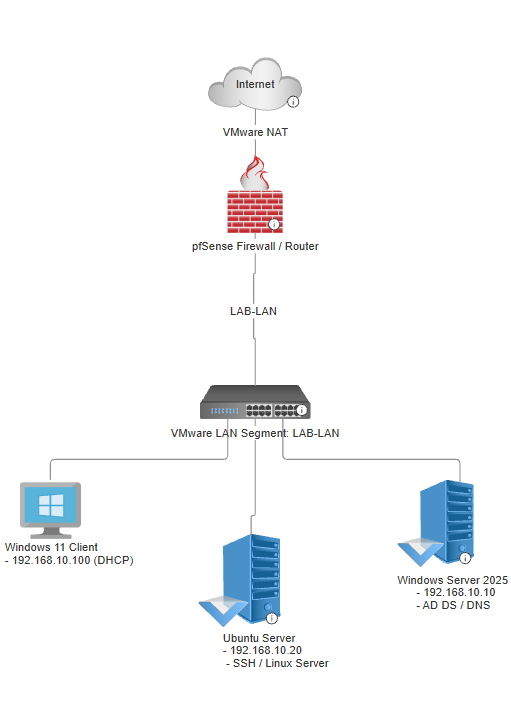

# pfSense-homelab

## Overview

This project is a virtualized networking and security homelab built using
VMware Workstation and pfSense.

The purpose of the lab is to gain hands-on experience with routing,
firewall configuration, VLAN segmentation, Windows Active Directory,
Linux administration, and security monitoring.

## Lab Environment

***Current:***
- VMware Workstation Pro
- pfSense CE
- Windows Server 2025
- Windows 11
- Ubuntu Server

***Planned:***
- Kali Linux
- Splunk

## Current Network Topology

## Network Addressing

- **pfSense LAN:** 192.168.10.1
  - Default gateway for the lab network

- **Windows Server 2025:** 192.168.10.10
  - Static IP
  - Will be used for Active Directory and DNS

- **Windows 11 Client:** 192.168.10.100 via DHCP
  - Client machine connected to the LAB-LAN

- **Ubuntu Server:** 192.168.10.20
  - Linux server

## Planned Skills and Technologies

As I continue building the lab, I plan to add Active Directory, Group Policy, VLAN segmentation, Linux systems, security monitoring, and cloud networking.

Future phases will also include Splunk, Kali Linux, firewall rule testing, inter-VLAN routing, and Azure networking/security concepts.

## Documentation

### Setup

- [pfSense Setup](docs/setup/pfSense.md)
- [Windows 11 Pro Setup](docs/setup/Windows11Pro-VM.md)
- [Windows Server 2025 Setup](docs/setup/Windows-Server2025.md)

### Active Directory

- [Users, Groups, and OUs](docs/active-directory/users-groups.md)
- [Windows 11 Domain Join](docs/active-directory/domain-join.md)
- [Group Policy](docs/active-directory/group-policy.md)
- [Shared Folder Permissions](docs/active-directory/shared-folder-permissions.md)

### Troubleshooting

- [Windows 11 Network Connectivity Issue](troubleshooting/windows11-network.md)
- [Domain Controller Promotion Issue](troubleshooting/domain-controller-promotion.md)

### Linux

- [Ubuntu Server Setup](docs/linux/ubuntu-server.md)

  

## Phase 1 - Network Foundation

For Phase 1, I focused on getting the basic network working and making sure the devices in the lab could actually communicate through pfSense.

I set up pfSense as the firewall and router for the lab, using VMware NAT for the WAN connection and a separate LAB-LAN segment for the internal network.

- WAN: em0
- LAN: em1
- LAN Subnet: 192.168.10.0/24
- DHCP Range: 192.168.10.100 - 192.168.10.199

I connected a Windows 11 VM to the LAB-LAN and confirmed that it received an IP address from pfSense. I also added a Windows Server 2025 VM and gave it the static IP address 192.168.10.10.

After everything was connected, I tested both Windows machines to make sure they could reach the pfSense gateway, access the Internet, and resolve DNS successfully.

### Phase 1 Results:

- pfSense is working as the lab firewall and router
- Windows 11 is receiving an IP through DHCP
- Windows Server 2025 is using a static IP
- Both systems can reach the pfSense gateway
- Both systems have Internet access
- DNS resolution is working

[View Detailed pfSense Configuration](docs/setup/pfSense.md)

**Phase 1 Status: Complete**

  

## Phase 2 - Active Directory and Domain Services

For Phase 2, I focused on building out the Active Directory side of the lab using Windows Server 2025.

I installed Active Directory Domain Services and DNS, promoted the server to a domain controller, and created the 'lab.local' domain.

I created users and Global Security groups for IT, HR, and Marketing. I also created Organizational Units for each department and moved the users into the OU that matched their department.

[View Active Directory Users and Groups Documentation](docs/active-directory/users-groups.md)

After Active Directory was set up, I changed the Windows 11 client to use '192.168.10.10' for DNS and joined it to the 'lab.local' domain.

I tested the domain connection using "nslookup lab.local" and logged into Windows 11 using one of the domain accounts. I also used "whoami" to confirm that the account was being authenticated through the domain.

[View Windows 11 Domain Join Documentation](docs/active-directory/domain-join.md)

### Group Policy

I created and linked a Group Policy to the Marketing OU that blocked access to Control Panel and Windows Settings.

After applying the policy, I logged into the Windows 11 client using a Marketing account and confirmed that Windows blocked access as expected.

[View Group Policy Documentation](docs/active-directory/group-policy.md)

### Shared Folder Permissions

I created separate shared folders for IT, HR, and Marketing on Windows Server 2025 and used the department security groups to control access.

I tested the permissions from the Windows 11 client and confirmed that users could access and modify files in their own department folder while being blocked from folders they did not have permission to use.

[View Shared Folder Permissions Documentation](docs/active-directory/shared-folder-permissions.md)

### Phase 2 Results

- Windows Server 2025 promoted to a domain controller
- 'lab.local' domain created
- Active Directory Domain Services and DNS configured
- Department-based OUs created for IT, HR, and Marketing
- Users and Global Security groups created
- Windows 11 successfully joined to 'lab.local'
- Domain login and DNS resolution verified
- Group Policy created, linked, and successfully tested
- Department shared folders created
- Share and NTFS permissions configured using security groups
- Allowed and denied folder access successfully tested

**Phase 2 Status: Complete**

  

## Phase 3 - Linux Server Integration

For Phase 3, I started adding Linux to the lab by setting up an Ubuntu Server VM and connecting it to the existing 'LAB-LAN'.

I gave the Ubuntu server a static IP of '192.168.10.20', with pfSense at '192.168.10.1' as the gateway and Windows Server 2025 at '192.168.10.10' handling DNS.

After getting the server installed, I tested connectivity to the pfSense gateway and made sure Ubuntu could resolve 'lab.local' through the Windows Server DNS service.

I also installed OpenSSH and tested remote access from the Windows 11 client using: "ssh zamir@192.168.10.20"

[View Ubuntu Server Documentation](docs/linux/ubuntu-server.md)

The next step is working with Linux users, groups, and file permissions before setting up a basic web server and adding a DNS record for the Ubuntu server.

**Phase 3 Status: In Progress**
