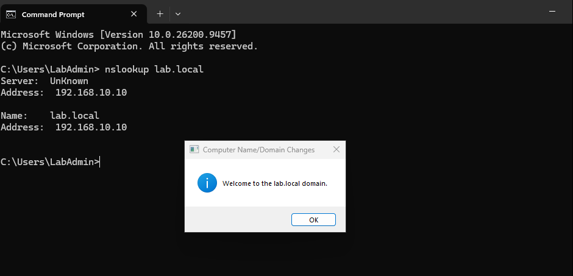
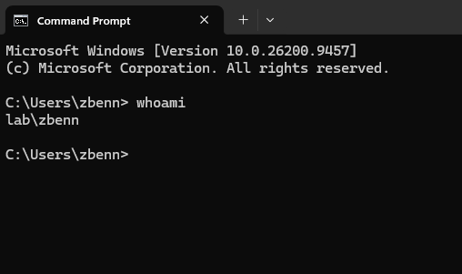

# Windows 11 Domain Join

## Domain Connection

After getting Active Directory and DNS set up on Windows Server 2025, I connected the Windows 11 VM to the 'lab.local' domain.

Before joining the domain, I changed the Windows 11 DNS server to '192.168.10.10' so it could find the domain through the Windows Server.

I ran 'nslookup lab.local' first to make sure DNS was working, and once that came back correctly, I joined the Windows 11 VM to the domain.

## Domain Login Test

After joining the domain, I restarted the Windows 11 VM and logged in using one of the accounts I created in Active Directory.

To make sure I was actually logged in through the domain, I ran "whoami" which returned  "lab\zbenn"

That confirmed the Windows 11 client was joined to 'lab.local' and the domain account was working correctly.

