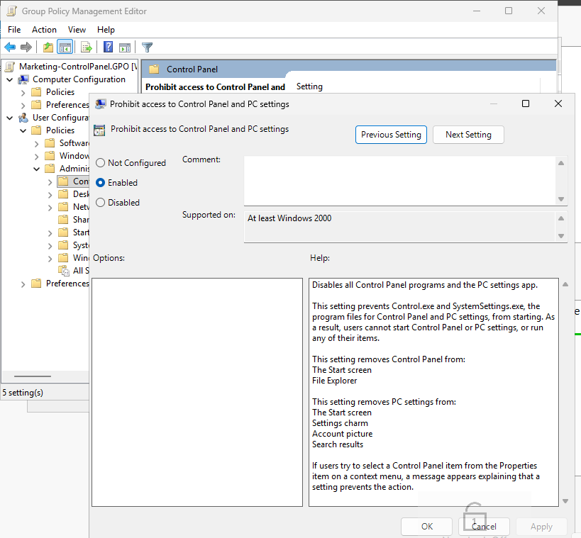
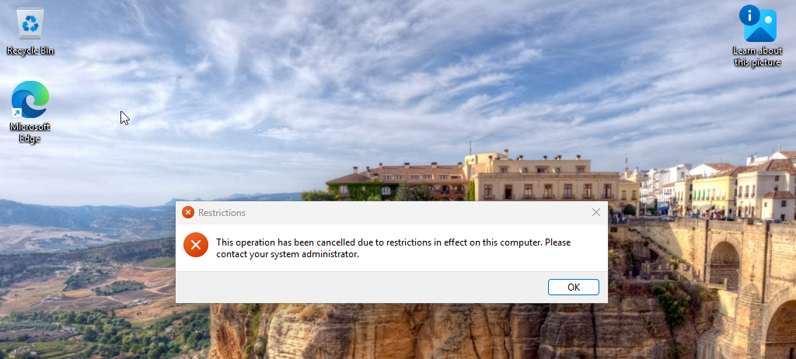

# Group Policy Setup

## Overview

For this part of Phase 2, I started working with Group Policy and tested it on the Marketing OU.

The goal was to make sure I could create a GPO, link it to an OU, and confirm that the policy was actually being applied to a user on the Windows 11 client.

## Control Panel Restriction

I created a GPO called: "Marketing-ControlPanel.GPO"

Inside the GPO, I enabled: "Prohibit access to Control Panel and PC settings`

I linked the policy to the Marketing OU so the users inside that OU would receive the restriction.

After the policy was applied, I logged into the Windows 11 VM using a Marketing domain account and tried opening Control Panel.

Windows blocked the action and showed a message saying the operation was cancelled because of restrictions on the computer.

