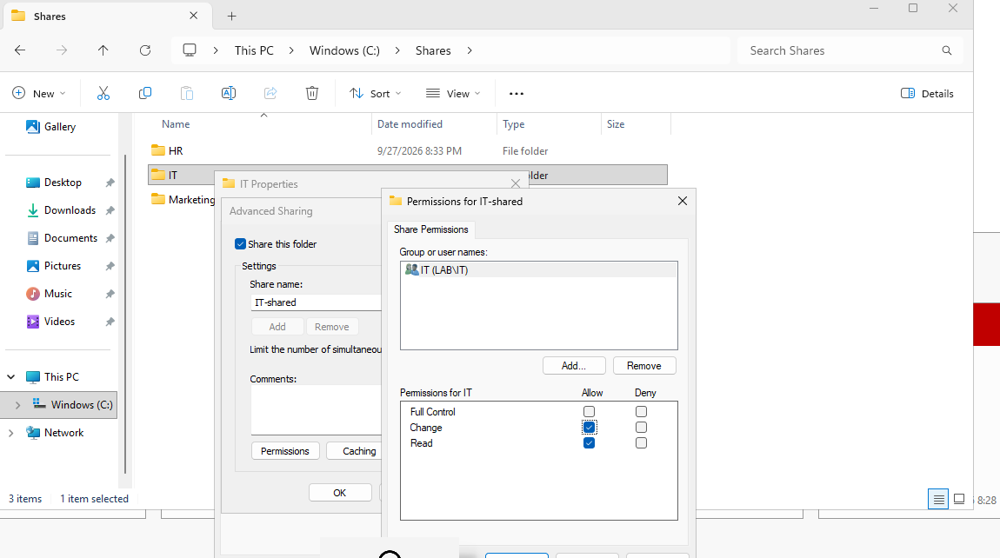
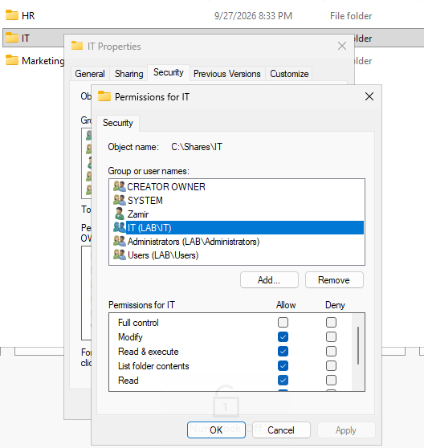
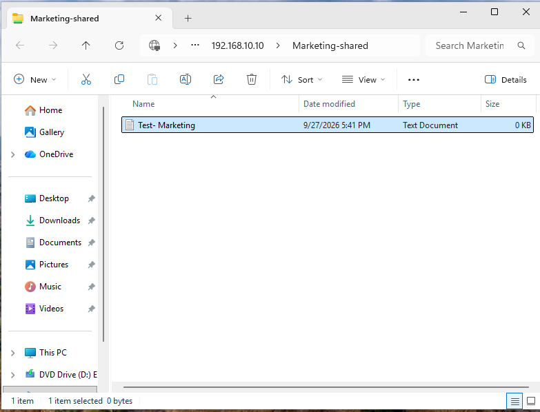
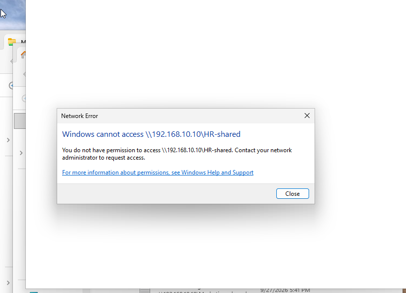

# Shared Folder Permissions

## Overview

For this part of Phase 2, I used the security groups I created earlier to control access to shared department folders.

I created separate folders for IT, HR, and Marketing on Windows Server 2025 and shared them across the 'LAB-LAN'.

## Share Permissions

Each department security group was given access to its matching shared folder.

For example, the IT security group was given Change and Read permissions on the 'IT-shared' folder.

I also configured the NTFS permissions so members of the IT group could modify, read, and write files inside the folder.

## Access Testing

I tested the permissions from the Windows 11 domain client using a Marketing account.

The Marketing user was able to open the Marketing shared folder and create a test file.

I then tried opening the HR shared folder while still logged in with the Marketing account. Windows blocked the connection because the account did not have permission to access that folder.

This confirmed that the department security groups were controlling access correctly and that users could access their own department resources without automatically getting access to the other department folders.
