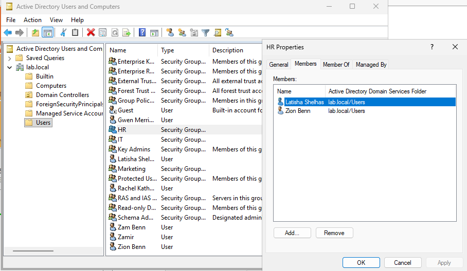

## Overview

For this part of Phase 2, I started organizing the 'lab.local' domain by creating users and security groups for different departments.

The main goal was to make the lab feel more like a real environment and set things up so I can use the groups later for permissions, shared folders, and Group Policy.

## Active Directory Setup

I created departments for:

- IT
- HR
- Marketing

I then created users for each department and made Global Security groups for them so the accounts would be easier to manage.

## Adding Users to Groups

Once the groups were created, I added each user to the group that matched their department.

For example, the HR users were added to the HR security group, and I repeated the same process for IT and Marketing.

These groups will be used later when I start working with:

- Shared folder permissions
- Access control
- Group Policy
- Department-based user management

The screenshot below shows one of the security groups with its assigned users.

## Result

At this point, the 'lab.local' domain has a basic user and group structure set up. This gives me a good starting point for adding shared resources, permissions, and Group Policy later in the lab.
