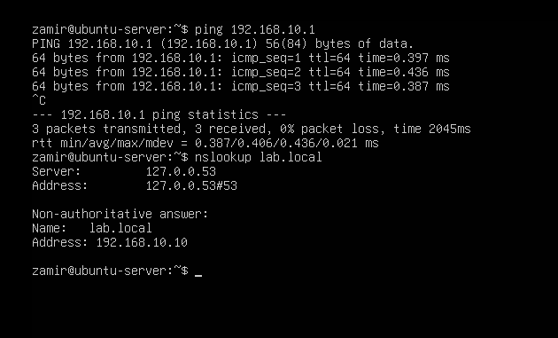

# Ubuntu Server Setup

## Network Configuration

For Phase 3, I added an Ubuntu Server VM to the existing 'LAB-LAN' network.

I configured the server with a static IP so it would have a consistent address inside the lab.

- IP Address: 192.168.10.20
- Subnet: 192.168.10.0/24
- Gateway: 192.168.10.1
- DNS Server: 192.168.10.10
- Search Domain: lab.local

## Network Testing

After the server was installed, I tested connectivity to the pfSense gateway and checked that the Ubuntu server could resolve the 'lab.local' domain.

The server was able to reach '192.168.10.1', and 'lab.local' successfully resolved to the Windows Server at '192.168.10.10'.

## SSH Testing

I installed OpenSSH during the Ubuntu Server setup so I could manage the server remotely.

From the Windows 11 client, I connected to the Ubuntu server using 'ssh zamir@192.168.10.20'.

The SSH connection was successful and allowed me to manage the Ubuntu server directly from the Windows client.

## Linux Users and Groups

I created a second Linux user named 'alex' and a group named 'webadmins'.

I then added both 'zamir' and 'alex' to the 'webadmins' group and checked the group memberships from the terminal.

## File Permissions

To practice Linux permissions, I created '/srv/linux-share' and gave the 'webadmins' group access to the folder.

I tested the permissions using both accounts. Both 'zamir' and 'alex' were able to create files inside the shared directory.

## Nginx Web Server

I installed Nginx on the Ubuntu server and checked that the service was running.

I first tested it locally using 'curl http://localhost'.

The Ubuntu server returned the default Nginx page, confirming that the web server was working.

I also opened the server from the Windows 11 client using '192.168.10.20' and confirmed that the Nginx page could be reached across the 'LAB-LAN'.

## DNS Record

On Windows Server 2025, I created a new DNS Host (A) record for the Ubuntu server.

The record points 'ubuntu-server.lab.local' to '192.168.10.20'.

## DNS and Hostname Testing

From the Windows 11 client, I used 'nslookup' and 'ping' to make sure the new hostname resolved correctly.

I also connected to the Ubuntu server through SSH using the hostname instead of the IP address with 'ssh zamir@ubuntu-server.lab.local'.

Finally, I opened 'http://ubuntu-server.lab.local' from the Windows 11 browser and successfully reached the Nginx web server.

