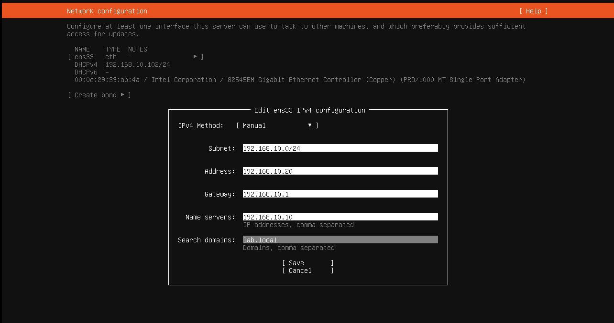
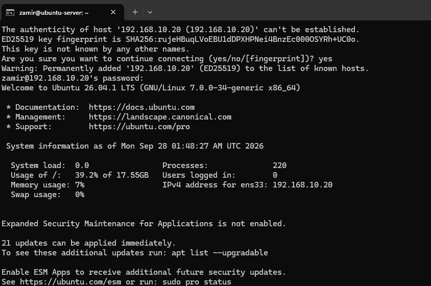

# Ubuntu Server Setup

## Network Configuration

For Phase 3, I added an Ubuntu Server VM to the existing 'LAB-LAN' network.

I configured the server with a static IP so it would have a consistent address inside the lab.

- IP Address: 192.168.10.20
- Subnet: 192.168.10.0/24
- Gateway: 192.168.10.1
- DNS Server: 192.168.10.10
- Search Domain: lab.local

## Network Testing

After the server was installed, I tested connectivity to the pfSense gateway and checked that the Ubuntu server could resolve the 'lab.local' domain.

The server was able to reach '192.168.10.1', and 'lab.local' successfully resolved to the Windows Server at 192.168.10.10.

## SSH Testing

I installed OpenSSH during the Ubuntu Server setup so I could manage the server remotely.

From the Windows 11 client, I connected to the Ubuntu server using: "ssh zamir@192.168.10.20"

The SSH connection was successful and allowed me to manage the Ubuntu server directly from the Windows client.

