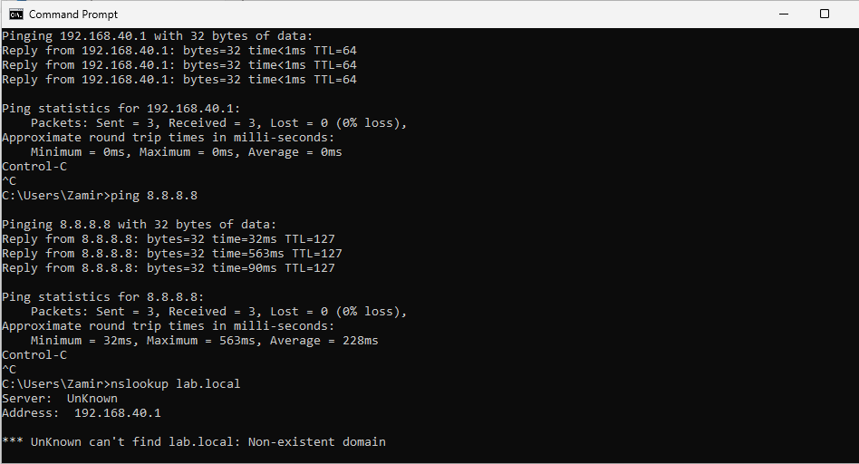
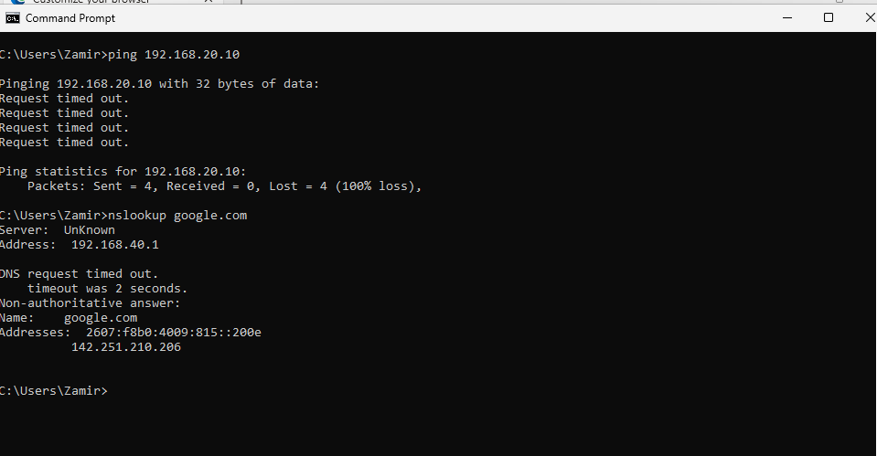
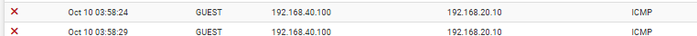

# GUEST Firewall Rules

## Overview

For this part of Phase 4, I finished configuring the GUEST network in pfSense.

I created a separate Windows 11 Guest VM and connected it to 'GUEST-LAN'. The goal was to give the guest device internet access while keeping it separated from the LAB, SERVER, and SECURITY networks.

## Network Configuration

The Windows 11 Guest received its network configuration through DHCP.

The Guest VM received:

- IP Address: 192.168.40.100
- Subnet Mask: 255.255.255.0
- Default Gateway: 192.168.40.1

.png)

## Internet Access

After configuring the GUEST firewall rules, I tested connectivity to the pfSense GUEST gateway at '192.168.40.1'.

I also tested internet access by pinging '8.8.8.8'. Both tests were successful.

I then used 'nslookup google.com' to confirm that public DNS resolution was working.

I also tested 'lab.local'. The Guest VM was not able to resolve the internal domain, which keeps the guest device separated from the Active Directory environment.

## Internal Network Isolation

I tested whether the Guest VM could communicate with Windows Server 2025 at '192.168.20.10'.

The ping requests timed out, showing that traffic from 'GUEST-LAN' to the SERVER network was being blocked.

I checked the pfSense firewall logs and confirmed that ICMP traffic from '192.168.40.100' to '192.168.20.10' was being blocked on the GUEST interface.

