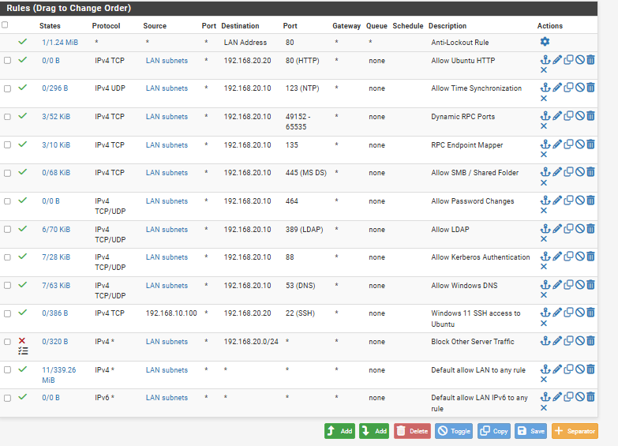

# LAN Firewall Rules

## Overview

For this part of Phase 4, I started configuring firewall rules on pfSense to control traffic between 'LAB-LAN' and 'SERVER-LAN'.

The goal was to allow Windows 11 to access the services it needed on Windows Server 2025 and Ubuntu Server while blocking other traffic between the two networks.

## Firewall Configuration

I created rules on the LAN interface to allow access to Windows Server 2025 at '192.168.20.10'.

The rules included:

- DNS - TCP/UDP 53
- Kerberos - TCP/UDP 88
- LDAP - TCP/UDP 389
- Password Changes - TCP/UDP 464
- SMB - TCP 445
- RPC Endpoint Mapper - TCP 135
- Dynamic RPC - TCP 49152-65535
- Time Synchronization - UDP 123

I also created rules allowing SSH on port 22 and HTTP on port 80 to the Ubuntu Server at '192.168.20.20'.

Most of the rules use 'LAN subnets' as the source, while the SSH rule is limited to the Windows 11 client at '192.168.10.100'.

After configuring the allow rules, I added a block rule for traffic going to the '192.168.20.0/24' SERVER network.

I placed the block rule below the allow rules but above the default LAN allow rule so that other traffic going to the SERVER network would be blocked.

## Firewall Testing

After applying the rules, I tested connections from the Windows 11 client at '192.168.10.100' to the servers on 'SERVER-LAN'.

I first tested the 'IT-shared' folder on Windows Server 2025 using 'Test-Path'. The command returned True, showing that the Windows 11 client could still access the shared folder.

I then used 'Test-NetConnection' to test SSH on port 22 and HTTPS on port 443 to the Ubuntu Server.

The SSH connection was successful, while the HTTPS connection timed out.

.png)

## Firewall Log Testing

After the HTTPS connection failed, I checked the pfSense firewall logs to see whether the block rule was responsible.

I enabled logging on the block rule and tested the connection again from Windows 11.

The logs showed that pfSense blocked TCP traffic from '192.168.10.100' to '192.168.20.20' on port 443.

.png)

This confirmed that Windows 11 could still access the services I allowed while other traffic to the SERVER network was being blocked.
