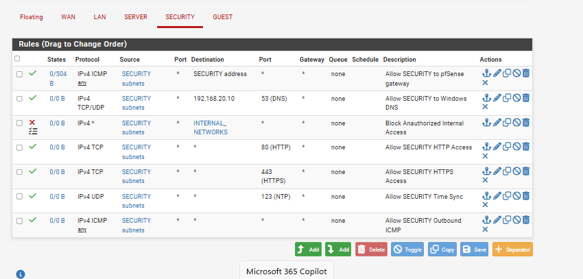
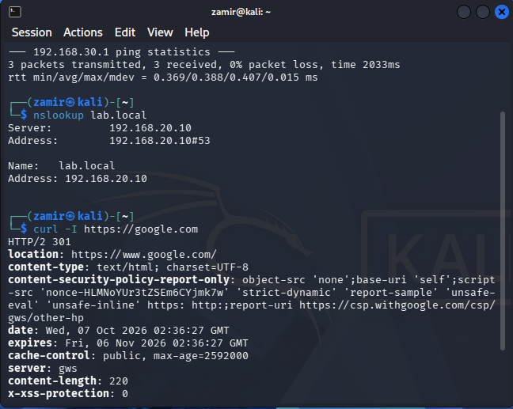
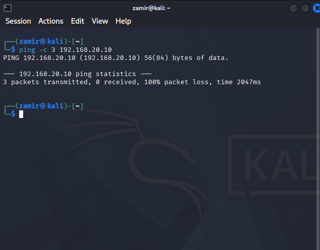
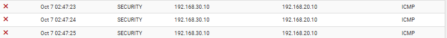

# SECURITY Firewall Rules

## Overview

For this part of Phase 4, I started configuring firewall rules on the SECURITY interface in pfSense.

After installing Kali Linux and connecting it to 'SECURITY-LAN', I wanted to make sure it could access the internet and DNS without having unrestricted access to the other networks.

## Firewall Configuration

I created rules on the SECURITY interface to allow Kali Linux to access the services it needed.

The rules included:

- ICMP - Communication with the pfSense SECURITY gateway
- DNS - TCP/UDP 53
- HTTP - TCP 80
- HTTPS - TCP 443
- Time Synchronization - UDP 123
- Outbound ICMP - Internet connectivity testing

I configured the DNS rule to allow traffic from 'SECURITY-LAN' to Windows Server 2025 at '192.168.20.10'.

I also used the 'INTERNAL_NETWORKS' alias I created earlier to block unauthorized traffic from 'SECURITY-LAN' to the other internal networks.

I placed the block rule below the DNS and gateway rules but above the general internet access rules.

## Firewall Testing

After applying the rules, I tested network connectivity from Kali Linux at '192.168.30.10'.

I first tested the pfSense SECURITY gateway at '192.168.30.1' and confirmed that Kali could reach it.

I then used 'nslookup lab.local' to check DNS resolution through Windows Server 2025. The domain resolved to '192.168.20.10'.

I also tested HTTPS connectivity using 'curl -I https://google.com' and received a response from the website.

## Firewall Block Testing

After confirming that DNS and internet access were working, I tested whether Kali could reach Windows Server 2025 using ICMP.

From Kali Linux, I ran 'ping -c 3 192.168.20.10'.

All three packets were lost, showing that Kali could no longer ping the Windows Server.

I then checked the pfSense firewall logs and found that ICMP traffic from '192.168.30.10' to '192.168.20.10' was being blocked on the SECURITY interface.

This confirmed that Kali could still use DNS and access the internet while pfSense blocked unauthorized traffic to the internal networks.
