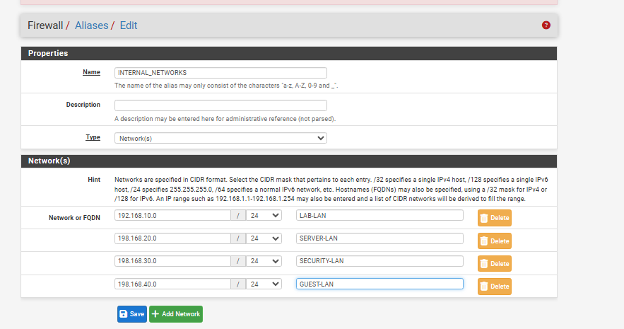
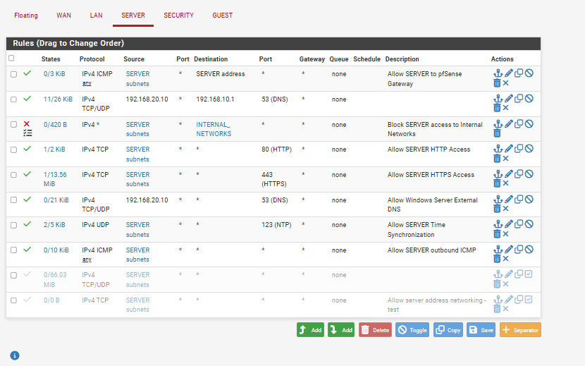
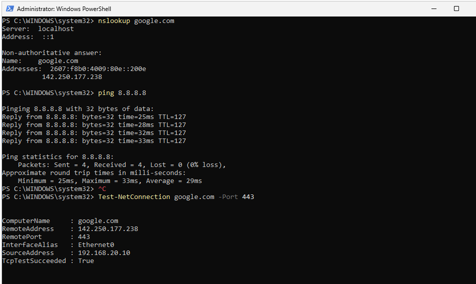
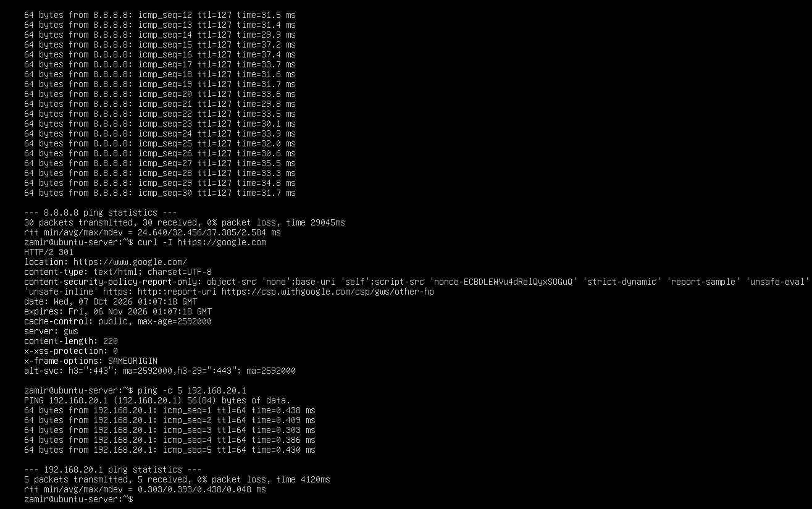
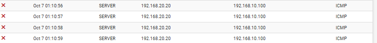

# SERVER Firewall Rules

## Overview

For this part of Phase 4, I configured firewall rules on the SERVER interface in pfSense.

The goal was to control what Windows Server 2025 and Ubuntu Server could access outside of 'SERVER-LAN' while still allowing both servers to use the services they needed.

## Firewall Configuration

I created rules on the SERVER interface to allow internet access, DNS, and communication with the pfSense gateway.

The rules included:

- ICMP - Communication with the pfSense SERVER gateway
- DNS - TCP/UDP 53
- HTTP - TCP 80
- HTTPS - TCP 443
- Time Synchronization - UDP 123
- Outbound ICMP - Internet connectivity testing

I also created an alias named 'INTERNAL_NETWORKS' containing the subnets used by the lab.

I used this alias to create a rule blocking traffic from 'SERVER-LAN' to the internal networks.

After applying the block rule, I ran into an issue where Windows Server could no longer resolve external domains. I found that Windows Server needed to forward DNS requests to pfSense at '192.168.10.1'.

I added a separate rule allowing Windows Server at '192.168.20.10' to send DNS requests to '192.168.10.1' on port 53.

I placed this rule above the internal network block rule so DNS forwarding would still work.

I also disabled the two broad allow rules I had created earlier for testing.

## Firewall Testing

After configuring the rules, I tested connectivity from both Windows Server 2025 and Ubuntu Server.

On Windows Server 2025, I used 'nslookup' to test external DNS resolution, pinged '8.8.8.8', and used 'Test-NetConnection' to check HTTPS connectivity on port 443.

The tests were successful, confirming that Windows Server could still resolve external domains and access the internet.

I also tested Ubuntu Server by pinging the pfSense SERVER gateway at '192.168.20.1' and Google's DNS server at '8.8.8.8'.

I used 'curl -I https://google.com' to check HTTPS connectivity.

The tests worked, and a longer ping test to '8.8.8.8' completed with 0% packet loss.

## Firewall Log Testing

After testing internet connectivity, I tested whether the SERVER firewall rules were blocking access to the Users network.

From Ubuntu Server at '192.168.20.20', I attempted to ping the Windows 11 client at '192.168.10.100'.

I then checked the pfSense firewall logs and found that ICMP traffic from Ubuntu to Windows 11 was being blocked on the SERVER interface.

This confirmed that the SERVER firewall rules were allowing the internet traffic I configured while blocking unauthorized connections to the other internal networks.
