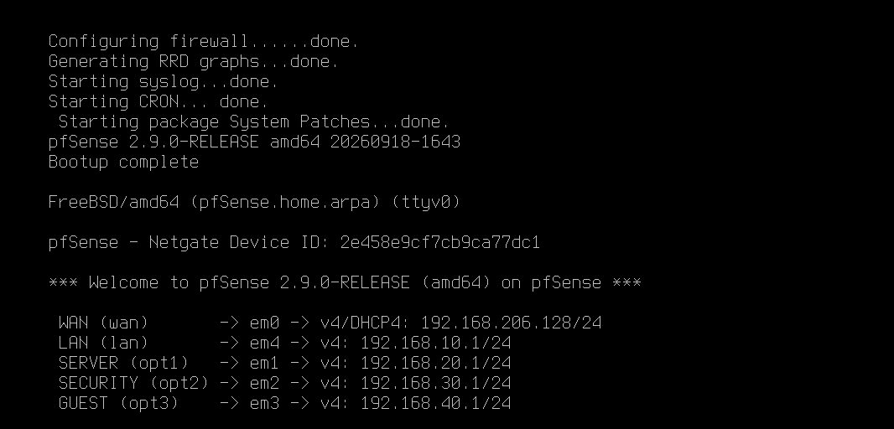
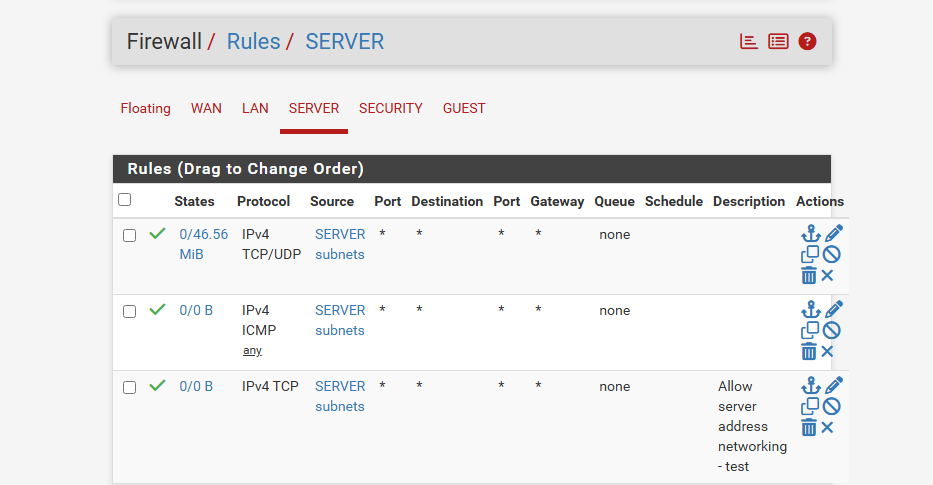
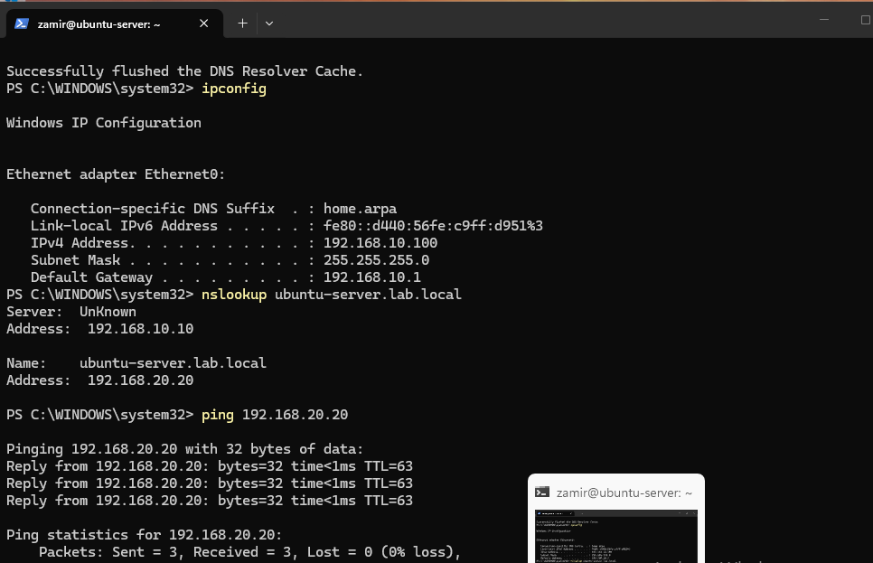
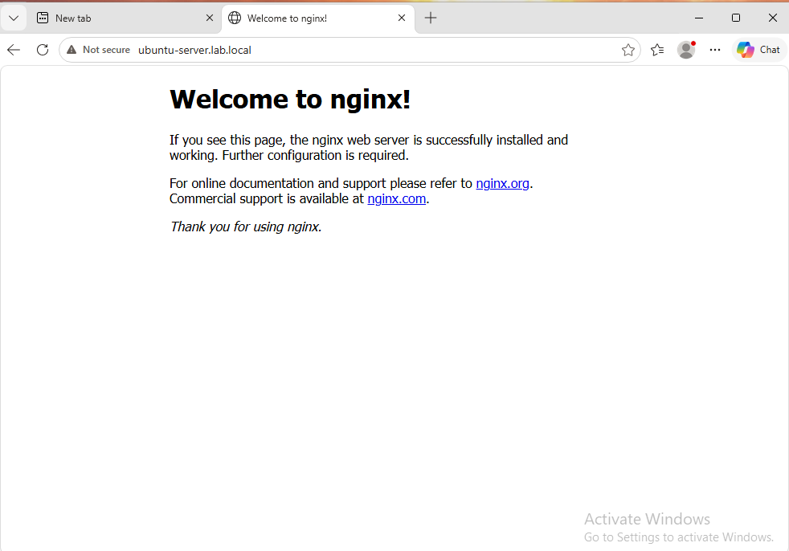

# Network Segmentation

## Network Layout

For Phase 4, I started separating the lab into different networks instead of keeping every device on the same 'LAB-LAN'.

I created separate VMware LAN Segments for the server, security, and guest networks and added additional network adapters to pfSense.

The networks are currently set up as:

- LAB-LAN - 192.168.10.0/24
- SERVER-LAN - 192.168.20.0/24
- SECURITY-LAN - 192.168.30.0/24
- GUEST-LAN - 192.168.40.0/24

## pfSense Interface Assignments

I assigned each VMware LAN Segment to its own interface in pfSense.

The interfaces are currently configured as:

- LAN - 192.168.10.1/24
- SERVER - 192.168.20.1/24
- SECURITY - 192.168.30.1/24
- GUEST - 192.168.40.1/24

While setting up the interfaces, I found that the VMware network adapter numbers did not match the pfSense interface names in the order I expected.

I compared the MAC addresses in VMware with the interface MAC addresses in pfSense and corrected the assignments.

## Ubuntu Server Network Change

I moved the Ubuntu Server from 'LAB-LAN' to the new 'SERVER-LAN' network.

The server originally used '192.168.10.20', but I changed the static IP to '192.168.20.20' and updated the default gateway to '192.168.20.1'.

.png)

## SERVER Firewall Rules

After moving the Ubuntu Server, I started creating firewall rules on the SERVER interface in pfSense.

I added rules to allow traffic from the SERVER subnet and also added an ICMP rule so the Ubuntu Server could communicate with the pfSense SERVER interface during testing.

## Inter-Subnet Testing

After the network changes were made, I tested communication between Windows 11 on 'LAB-LAN' and the Ubuntu Server on 'SERVER-LAN'.

The Windows 11 client remained on '192.168.10.100', while the Ubuntu Server was using '192.168.20.20'.

I updated the DNS record for 'ubuntu-server.lab.local' to point to '192.168.20.20'.

From Windows 11, I confirmed that the hostname resolved to the new address and that the client could ping the Ubuntu Server across the two networks.

I also opened 'ubuntu-server.lab.local' in the Windows 11 browser and successfully reached the Nginx web server which confirmed that pfSense was routing trafrfic between 'LAB-LAN' and "SERVER-LAN' correctly. 

