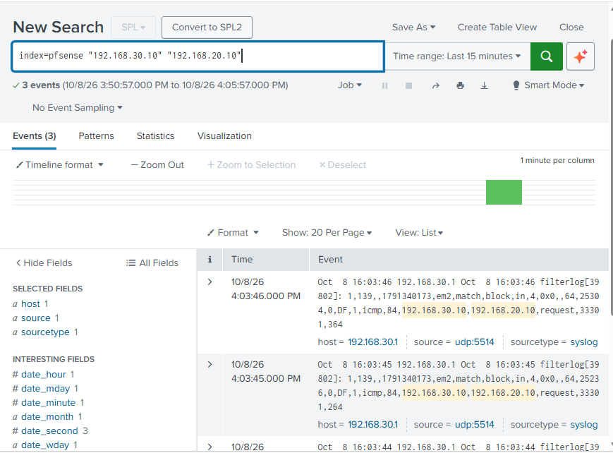

# pfSense Logging with Splunk

## Overview

After setting up Splunk Enterprise, I started using it as the centralized logging server for the lab.

For the first log source, I configured pfSense to send firewall and system events to the Splunk server at '192.168.30.20'.

## Splunk Logging Configuration

I created a separate Splunk index named 'pfsense' to keep firewall events organized.

I also configured Splunk to listen for syslog traffic on UDP port '5514'.

pfSense was then configured to send firewall and system logs to:

'192.168.30.20:5514'

Using a separate index allows me to search pfSense events without mixing them with logs from Windows and Linux systems that will be added later.

## Firewall Event Testing

To test the logging setup, I generated blocked traffic from Kali Linux at '192.168.30.10'.

From Kali, I attempted to ping Windows Server 2025 at '192.168.20.10'.

The SECURITY firewall rules blocked the connection as expected.

I then searched Splunk using:

'index=pfsense "192.168.30.10" "192.168.20.10"'

Splunk returned the firewall events showing traffic from Kali to Windows Server being blocked by pfSense.

