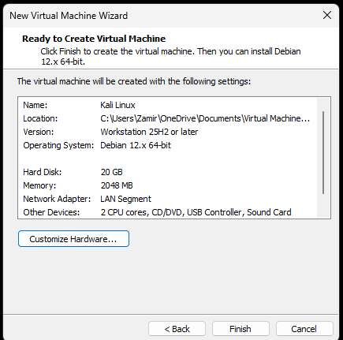
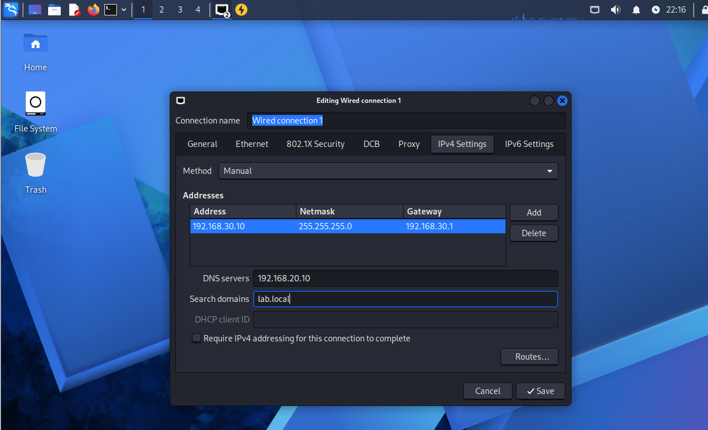

# Kali Linux Setup

## VM Setup

For this part of Phase 4, I added a Kali Linux VM to the new 'SECURITY-LAN' network.

I installed Kali Linux using VMware Workstation and selected Debian 12.x 64-bit as the guest operating system.

I configured the VM with:

- Memory: 2 GB
- Processors: 2
- Hard Disk: 20 GB
- Network Adapter: VMware LAN Segment

## Kali Linux Installation

During the installation, I set the hostname to 'kali' and used 'lab.local' as the domain name.

I used guided disk partitioning and installed Kali with the Xfce desktop environment and its default security tools.

After the installation finished, I logged into the Kali desktop and started configuring its network settings.

## Network Configuration

I connected the Kali Linux VM to 'SECURITY-LAN' and configured a static IP address so it would have a consistent address inside the lab.

The network settings are:

- IP Address: 192.168.30.10
- Subnet: 192.168.30.0/24
- Gateway: 192.168.30.1
- DNS Server: 192.168.20.10
- Search Domain: lab.local

I configured these settings through Kali's wired network connection using the manual IPv4 configuration.

