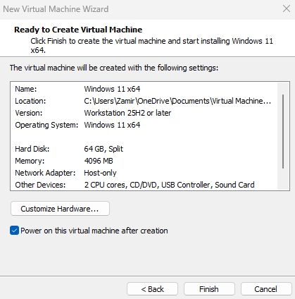
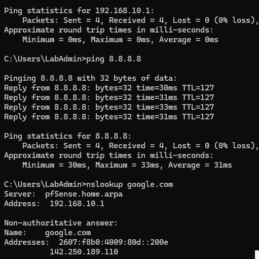

# Windows 11 VM Setup

## VM Configuration

- OS: Windows 11 x64
- CPU: 2 cores
- RAM: 4096 MB
- Storage: 64 GB
- Version : 25H2 or later
- Network Adapter: LAB-LAN / Host-only

## Windows 11 Connectivity Verification

After connecting the Windows 11 VM to the `LAB-LAN` segment, I verified that the client received network configuration from pfSense and could communicate through the firewall.

The Windows 11 client received:

- IP Address: 192.168.10.100
- Subnet Mask: 255.255.255.0
- Default Gateway: 192.168.10.1

I then tested connectivity using:

- 'ping 192.168.10.1' to verify communication with the pfSense gateway
- 'ping 8.8.8.8' to verify Internet connectivity
- 'nslookup google.com' to verify DNS resolution

All tests completed successfully with no packet loss.

