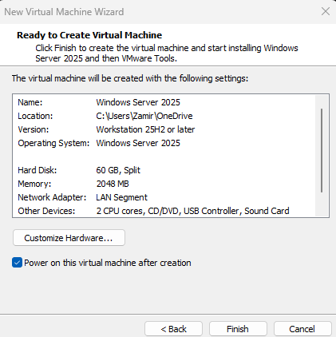
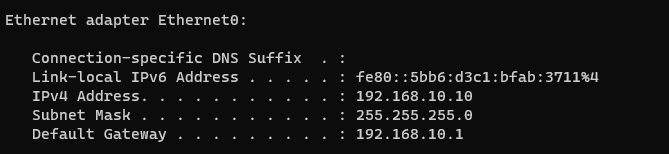
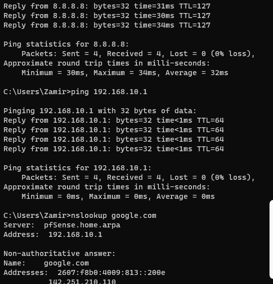

# Windows Server 2025 VM Setup

## VM Configuration

- OS: Windows Server 2025
- CPU: 2 cores
- RAM: 2048 MB
- Storage: 60 GB
- Version : 25H2 or later
- Network Adapter: LAB-LAN 

## Network Configuration

- IP Address: 192.168.10.10
- Subnet Mask: 255.255.255.0
- Default Gateway: 192.168.10.1

## Connectivity Verification

The server was able to reach the pfSense gateway, access the Internet, and resolve DNS.

