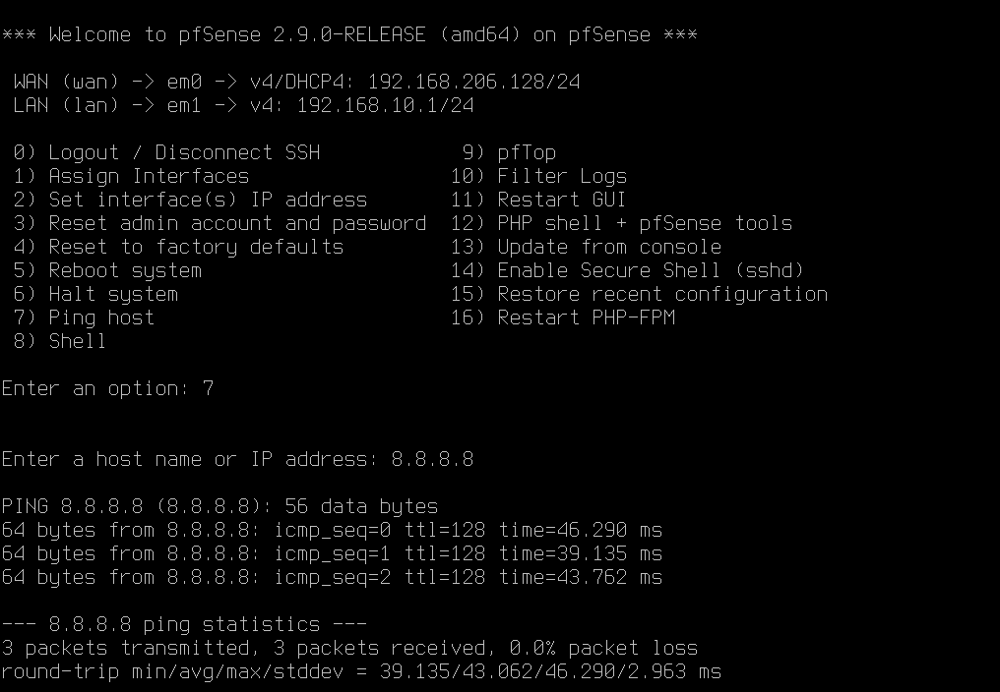
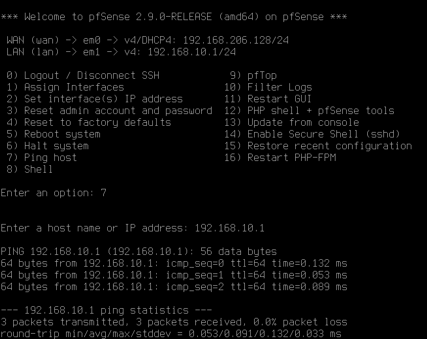

## WAN Configuration

- Interface: em0
- WAN IP: 192.168.206.128/24
- IPv4 Configuration: DHCP

## LAN Configuration

- Interface: em1
- Mode: Static
- LAN IP: 192.168.10.1/24
- DHCP: Enabled
- DHCP Pool - 192.168.10.100 - 192.168.10.199

## Verification and Connectivity Testing

After configuring the pfSense WAN and LAN interfaces, I performed connectivity tests to verify that the firewall was functioning correctly.

### WAN / Internet Connectivity

I tested external connectivity from pfSense by pinging a public IP address: `ping 8.8.8.8` 

The test was successful:

- 3 packets transmitted, 3 packets received, 0% packet loss

This confirmed that the WAN interface was successfully connected to the Internet through VMware NAT.

### LAN Interface Verification

I also tested the pfSense LAN interface by pinging its configured LAN address: `ping 192.168.10.1`

The test was successful:

- 3 packets transmitted, 3 packets received, 0% packet loss

This confirmed that the LAN interface was active and working correctly. 

### Current Results

At this stage, the following functionality has been verified:

- pfSense WAN interface received an IP address through DHCP
- pfSense has working Internet connectivity
- pfSense LAN interface is configured as 192.168.10.1/24
- pfSense LAN interface is reachable
- DHCP is enabled for the LAB-LAN network

