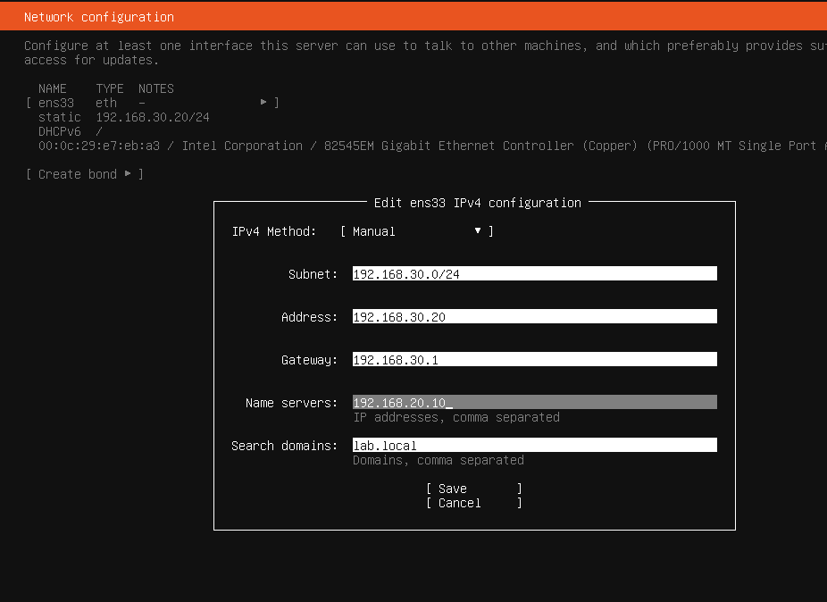
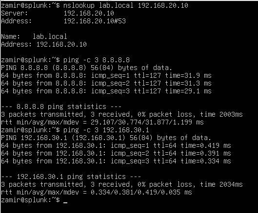
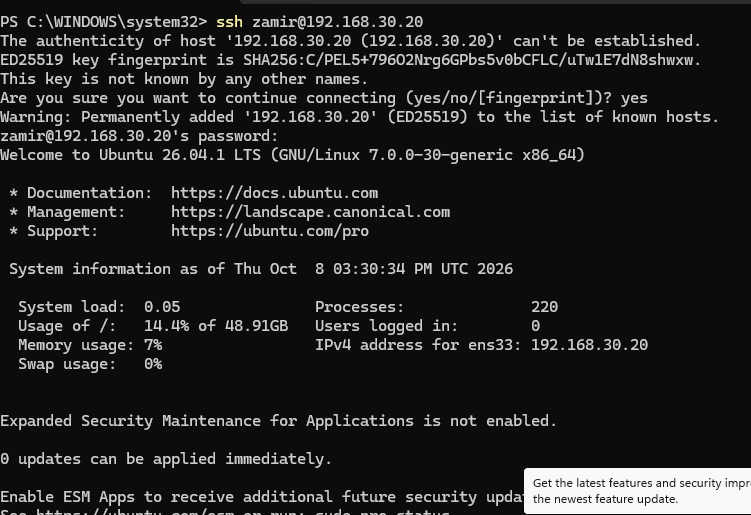
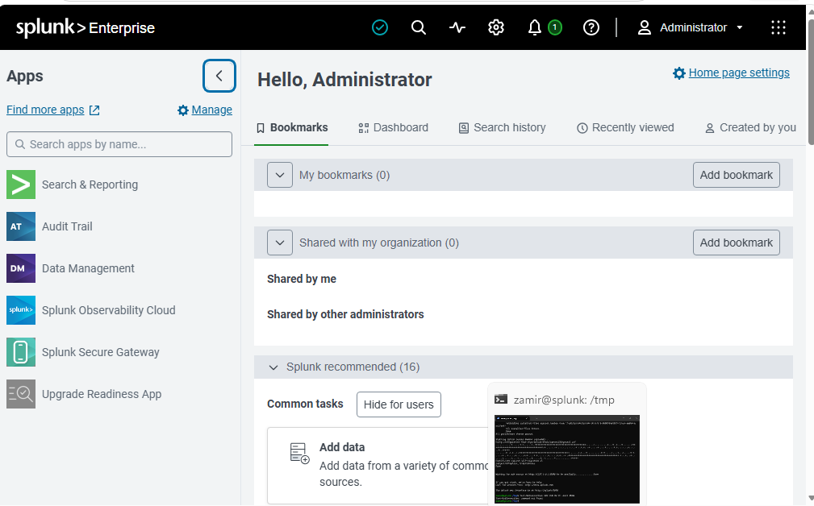
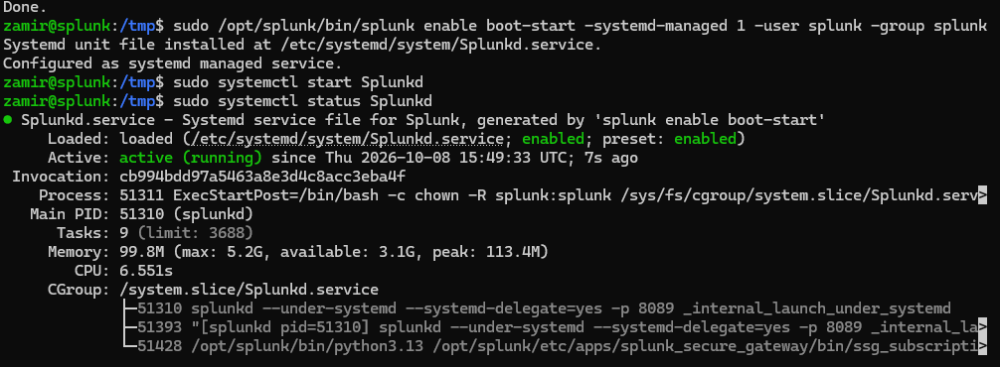

# Splunk Server Setup

## Overview

For Phase 5, I added a second Ubuntu Server VM to use as the Splunk server for the lab.

I connected the server to 'SECURITY-LAN' and configured it with a static IP address so it could receive and store logs from devices across the lab.

## Network Configuration

I configured the Splunk server with the following network settings:

- IP Address: 192.168.30.20/24
- Gateway: 192.168.30.1
- DNS Server: 192.168.20.10
- Search Domain: lab.local
- Hostname: splunk-server

After configuring the network, I tested connectivity to the pfSense SECURITY gateway and the Internet.

I also used 'nslookup lab.local 192.168.20.10' to confirm that the server could use the Windows Server 2025 DNS server.

## SSH Access

OpenSSH was already installed on the Ubuntu Server.

From the Windows 11 client, I connected to the server using:

'ssh zamir@192.168.30.20'

This confirmed that I could remotely manage the Splunk server from the LAB network.

## Splunk Enterprise

I installed Splunk Enterprise on the Ubuntu Server and configured it to run under a dedicated 'splunk' service account.

After starting Splunk, I accessed Splunk Web from the Windows 11 client using:

'http://192.168.30.20:8000'

## Automatic Startup

I configured Splunk as a systemd-managed service so it starts automatically when the Ubuntu Server boots.

I verified the service using 'systemctl status Splunkd' and confirmed that it was enabled and running.

